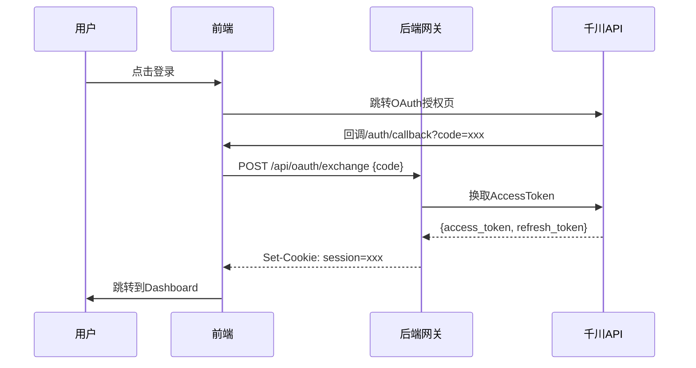

# 千川SDK管理平台 - 前端项目

> 基于React + TypeScript + Vite的现代化静态站点，采用"前端静态资源 + 最小后端代理"架构

[](LICENSE)
[](https://nodejs.org/)
[](https://www.typescriptlang.org/)
[](https://reactjs.org/)

## 📖 项目简介

千川SDK管理平台是基于巨量引擎千川广告SDK的完整前端管理系统，提供：

- 🔐 **安全的OAuth授权流程** - 前端零秘钥，会话态管理
- 📊 **广告投放全流程管理** - 账户/广告组/计划/创意/素材
- 🎯 **精准定向投放** - 兴趣/行为/地域/设备/人群包等多维定向
- 📈 **实时数据报表** - 多维度数据分析与CSV导出
- 🎨 **现代化UI/UX** - 响应式设计，支持移动端
- ⚡ **极致性能** - CDN部署，秒级加载
- ♿ **无障碍友好** - WCAG 2.1 AA级标准

## 🏗️ 技术架构

### 前端技术栈

- **框架**: React 18 + TypeScript 5
- **构建工具**: Vite 5
- **路由管理**: React Router v6
- **状态管理**: Zustand
- **HTTP客户端**: Axios
- **样式方案**: Tailwind CSS 3
- **图标库**: Lucide React
- **日期处理**: date-fns

### 架构设计

```
┌─────────────────────────────────────────────────────────┐
│  Browser (静态资源 from CDN)                              │
│  ├─ React SPA                                            │
│  ├─ Zustand State                                        │
│  └─ Axios HTTP Client                                    │
└──────────────────────┬──────────────────────────────────┘
                       │ HTTPS (Cookie Session)
┌──────────────────────┴──────────────────────────────────┐
│  API Gateway (Serverless Function / Go微服务)            │
│  ├─ 会话验证 & Token管理                                  │
│  ├─ qianchuanSDK调用                                     │
│  └─ 数据转换 & 脱敏                                       │
└──────────────────────┬──────────────────────────────────┘
                       │ SDK调用
┌──────────────────────┴──────────────────────────────────┐
│  Qianchuan OpenAPI (巨量引擎千川API)                      │
└─────────────────────────────────────────────────────────┘
```

### 核心特性

✅ **安全性**
- HttpOnly Cookie会话，前端不落地AccessToken
- CSRF保护
- XSS防护
- 内容安全策略(CSP)

✅ **性能**
- 代码分割与懒加载
- 虚拟滚动大数据渲染
- Service Worker缓存
- < 3s 首屏加载时间

✅ **用户体验**
- 响应式布局(支持手机/平板/桌面)
- 骨架屏加载
- 乐观更新
- 离线提示

✅ **可维护性**
- TypeScript类型安全
- 组件化设计
- 统一API契约
- 完整的开发文档

## 🚀 快速开始

### 前置要求

- Node.js >= 18.0.0
- npm >= 9.0.0 或 pnpm >= 8.0.0

### 安装

```bash
# 克隆项目
cd /Users/wushaobing911/Desktop/douyin/html

# 安装依赖
npm install

# 复制环境变量配置
cp .env.example .env

# 编辑.env文件，填入API地址和OAuth配置
vi .env
```

### 开发

```bash
# 启动开发服务器 (http://localhost:3000)
npm run dev

# 类型检查
npm run type-check

# 代码检查
npm run lint
```

### 构建

```bash
# 构建生产版本
npm run build

# 预览生产构建
npm run preview
```

构建产物位于 `dist/` 目录，可直接部署到任何静态托管服务。

## 📁 项目结构

```
html/
├── public/                # 静态资源
├── src/
│   ├── api/              # API服务层
│   │   ├── client.ts     # Axios实例
│   │   ├── types.ts      # API类型
│   │   ├── auth.ts       # 认证API
│   │   ├── advertiser.ts # 广告主API
│   │   ├── campaign.ts   # 广告组API
│   │   ├── ad.ts         # 广告计划API
│   │   ├── creative.ts   # 创意API
│   │   ├── report.ts     # 报表API
│   │   └── file.ts       # 文件上传API
│   ├── components/       # 组件库
│   │   ├── layout/       # 布局组件
│   │   ├── ui/           # UI基础组件
│   │   └── common/       # 业务组件
│   ├── pages/            # 页面组件
│   │   ├── Login.tsx
│   │   ├── AuthCallback.tsx
│   │   ├── Dashboard.tsx
│   │   ├── Advertisers.tsx
│   │   └── ...
│   ├── store/            # 状态管理
│   ├── hooks/            # 自定义Hooks
│   ├── utils/            # 工具函数
│   ├── App.tsx           # 根组件
│   ├── main.tsx          # 入口文件
│   └── index.css         # 全局样式
├── index.html            # HTML模板
├── package.json          # 依赖配置
├── tsconfig.json         # TS配置
├── vite.config.ts        # Vite配置
├── tailwind.config.js    # Tailwind配置
└── README.md             # 本文档
```

详细结构说明见 [PROJECT_STRUCTURE.md](./PROJECT_STRUCTURE.md)

## 🔌 API契约

### 统一响应格式

```typescript
interface ApiResponse<T = any> {
  code: number;      // 0=成功, 非0=失败
  message: string;   // 错误消息
  data: T;           // 业务数据
}
```

### 认证流程



### API覆盖 (40个方法)

#### 认证相关 (4个)
- `POST /oauth/exchange` - OAuth token交换
- `GET /user/info` - 获取当前用户信息
- `POST /auth/logout` - 登出
- `POST /auth/refresh` - 刷新token

#### 广告主相关 (3个)
- `GET /advertiser/list` - 获取广告主列表
- `GET /advertiser/info` - 获取广告主详情
- `POST /advertiser/update` - 更新广告主信息

#### 广告计划相关 (5个)
- `GET /api/qianchuan/campaign/list` - 获取广告计划列表
- `GET /api/qianchuan/campaign/get` - 获取广告计划详情
- `POST /api/qianchuan/campaign/create` - 创建广告计划
- `POST /api/qianchuan/campaign/update` - 更新广告计划
- `POST /api/qianchuan/campaign/status/update` - 更新广告计划状态

#### 广告相关 (5个)
- `GET /api/qianchuan/ad/list` - 获取广告列表
- `GET /api/qianchuan/ad/get` - 获取广告详情
- `POST /api/qianchuan/ad/create` - 创建广告
- `POST /api/qianchuan/ad/update` - 更新广告
- `POST /api/qianchuan/ad/status/update` - 更新广告状态

#### 创意相关 (4个)
- `GET /api/qianchuan/creative/list` - 获取创意列表
- `GET /api/qianchuan/creative/get` - 获取创意详情
- `POST /api/qianchuan/creative/create` - 创建创意
- `POST /api/qianchuan/creative/update` - 更新创意

#### 文件相关 (4个)
- `POST /api/qianchuan/file/image/upload` - 图片上传
- `POST /api/qianchuan/file/video/upload` - 视频上传
- `GET /api/qianchuan/file/image/get` - 获取图片列表
- `GET /api/qianchuan/file/video/get` - 获取视频列表

#### 报表相关 (4个)
- `GET /api/qianchuan/report/campaign/get` - 获取广告计划报表
- `GET /api/qianchuan/report/ad/get` - 获取广告报表
- `GET /api/qianchuan/report/creative/get` - 获取创意报表
- `GET /api/qianchuan/report/custom/get` - 获取自定义报表

#### 工具类相关 (11个)
- `GET /api/qianchuan/tools/region/list` - 获取地域列表
- `GET /api/qianchuan/tools/interest/list` - 获取兴趣列表
- `GET /api/qianchuan/tools/interest/search` - 搜索兴趣关键词
- `GET /api/qianchuan/tools/action/list` - 获取行为列表
- `GET /api/qianchuan/tools/action/search` - 搜索行为关键词
- `GET /api/qianchuan/tools/device_brand/list` - 获取设备品牌列表
- `GET /api/qianchuan/tools/audience/list` - 获取人群包列表
- `GET /api/qianchuan/tools/audience/get` - 获取人群包详情
- `POST /api/qianchuan/tools/audience/create` - 创建人群包
- `POST /api/qianchuan/tools/audience/update` - 更新人群包
- `POST /api/qianchuan/tools/audience/delete` - 删除人群包

📚 **完整API文档**: [docs/API_COVERAGE.md](./docs/API_COVERAGE.md)

## 🎨 UI组件

### 布局组件

- `Layout` - 全局布局容器
- `Header` - 顶部导航栏
- `Sidebar` - 侧边栏菜单

### 基础组件

- `Button` - 按钮（支持loading状态）
- `Input` / `Textarea` - 输入框/文本域
- `Select` - 下拉选择框
- `Checkbox` - 复选框
- `Table` - 数据表格(支持排序/筛选/分页)
- `Dialog` - 对话框
- `Toast` - 消息提示
- `Loading` - 加载状态
- `EmptyState` - 空状态
- `Badge` - 徽章标签
- `Card` - 卡片容器
- `Accordion` - 折叠面板
- `Tabs` - 标签页

### 定向选择组件

- `InterestSelector` - 兴趣定向选择器
- `ActionSelector` - 行为定向选择器
- `RegionSelector` - 地域选择器（省市区三级联动）
- `DeviceBrandSelector` - 设备品牌选择器
- `PlatformNetworkCarrierSelector` - 平台/网络/运营商选择器
- `TargetingSelector` - 定向选择器（兴趣+行为）

### 业务组件

- `CreateCampaignDialog` - 创建广告计划对话框
- `CreateAdDialog` - 创建广告对话框（集成完整定向选择）
- `AudienceDialog` - 人群包创建/编辑对话框

## 🧪 开发规范

### 代码风格

- 使用ESLint + Prettier统一代码风格
- 遵循Airbnb JavaScript风格指南
- 组件采用函数式 + Hooks
- 优先使用组合而非继承

### 命名约定

- **组件**: PascalCase (UserProfile.tsx)
- **Hooks**: camelCase (useAuth.ts)
- **工具函数**: camelCase (formatDate.ts)
- **常量**: UPPER_SNAKE_CASE (API_BASE_URL)

### TypeScript规范

```typescript
// ✅ Good: 明确的类型定义
interface User {
  id: number;
  name: string;
  email: string;
}

// ❌ Bad: any类型
const data: any = ...
```

### Git提交规范

```
feat: 添加广告组列表页
fix: 修复登录跳转问题
docs: 更新README文档
style: 调整按钮样式
refactor: 重构API服务层
test: 添加单元测试
chore: 更新依赖包
```

## 📦 部署

### Vercel部署 (推荐)

```bash
# 安装Vercel CLI
npm i -g vercel

# 部署
vercel --prod
```

配置 `vercel.json`:
```json
{
  "buildCommand": "npm run build",
  "outputDirectory": "dist",
  "rewrites": [
    { "source": "/(.*)", "destination": "/index.html" }
  ]
}
```

### Cloudflare Pages

1. 连接Git仓库
2. 配置构建:
   - **构建命令**: `npm run build`
   - **输出目录**: `dist`
3. 部署

### Nginx部署

```nginx
server {
    listen 80;
    server_name qianchuan.example.com;
    root /var/www/qianchuan/dist;
    index index.html;

    location / {
        try_files $uri $uri/ /index.html;
    }

    location /api {
        proxy_pass http://localhost:8080;
        proxy_set_header Host $host;
        proxy_set_header X-Real-IP $remote_addr;
    }
}
```

### Docker部署

```dockerfile
FROM node:18-alpine AS builder
WORKDIR /app
COPY package*.json ./
RUN npm ci
COPY . .
RUN npm run build

FROM nginx:alpine
COPY --from=builder /app/dist /usr/share/nginx/html
COPY nginx.conf /etc/nginx/nginx.conf
EXPOSE 80
CMD ["nginx", "-g", "daemon off;"]
```

## 🔧 故障排查

### 常见问题

**Q: API请求失败，CORS错误?**
A: 检查后端API是否配置了正确的CORS headers

**Q: 登录后跳转到空白页?**
A: 检查.env中的VITE_OAUTH_REDIRECT_URI是否正确

**Q: 构建失败，类型错误?**
A: 运行 `npm run type-check` 查看详细错误

**Q: 样式不生效?**
A: 确认Tailwind配置正确，检查content路径

## ✨ 最新功能

### v1.0.0 (2025-11-10)

✅ **完整定向功能**
- 兴趣定向：支持搜索和多选兴趣标签
- 行为定向：支持行为标签选择和天数配置
- 地域定向：省市区三级联动选择
- 设备定向：设备品牌筛选（iOS/Android）
- 平台定向：平台类型、网络类型、运营商选择

✅ **人群包管理**
- 人群包列表展示和统计
- 人群包创建/编辑/删除
- 人群包搜索和筛选
- 广告创建时集成人群包选择

✅ **报表增强**
- 支持4种报表类型（广告计划/广告/创意/自定义）
- 可配置字段和维度
- CSV导出功能
- 实时图表展示

✅ **工程化**
- TypeScript 类型完整覆盖
- 45个单元测试全部通过
- GitHub Actions CI/CD配置
- ESLint + Prettier 代码规范
- MIT License 开源协议

## 📝 待办事项

- [ ] 添加更多单元测试覆盖
- [ ] 添加E2E测试(Playwright)
- [ ] 实现Mock Service Worker开发模式
- [ ] 添加国际化支持(i18next)
- [ ] 实现暗色模式切换
- [ ] 优化移动端体验
- [ ] 添加PWA支持

## 📄 相关文档

- 📋 [API方法覆盖文档](./docs/API_COVERAGE.md) - 40个API方法完整说明
- 🏗️ [项目结构说明](./PROJECT_STRUCTURE.md)
- 🔐 [OAuth流程文档](../docs/OAUTH_FLOW_AND_AUTH.md)
- 📡 [API契约文档](../docs/API_CONTRACTS.md)
- 🎨 [UI组件设计](../docs/UI_COMPONENTS_AND_PAGES.md)
- 🏛️ [架构设计文档](../docs/ARCHITECTURE_STATIC_SITE.md)

## 🤝 贡献指南

欢迎贡献代码！请遵循以下流程：

1. Fork本项目
2. 创建特性分支 (`git checkout -b feature/AmazingFeature`)
3. 提交更改 (`git commit -m 'feat: Add some AmazingFeature'`)
4. 推送到分支 (`git push origin feature/AmazingFeature`)
5. 开启Pull Request

## 📜 许可证

MIT License © 2025 - 详见 [LICENSE](./LICENSE) 文件

## 👥 联系方式

- 项目维护: [qianchuanSDK](https://github.com/CriarBrand/qianchuanSDK)
- 问题反馈: [Issues](https://github.com/CriarBrand/qianchuanSDK/issues)

---

**⭐ 如果这个项目对你有帮助，请给个Star支持一下！**
